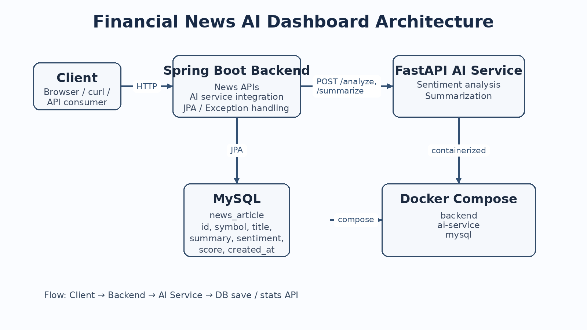
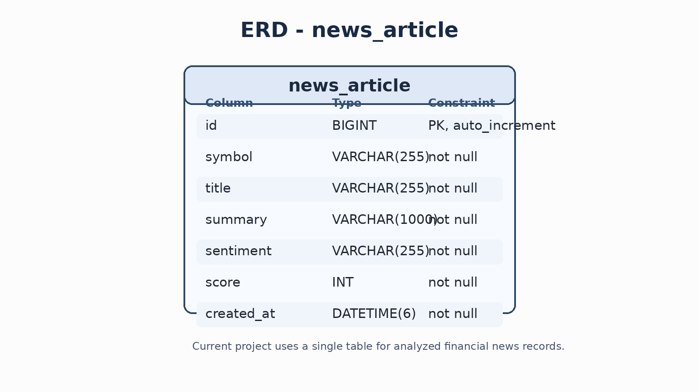

# AI Financial News Analyzer

AI 기반 금융 뉴스 감성 분석 백엔드 시스템

Spring Boot와 FastAPI 기반 AI 서비스를 분리한 마이크로서비스 구조로  
금융 뉴스 데이터를 분석하고 저장 및 통계를 제공하는 프로젝트입니다.

---

# System Architecture



---

# Tech Stack

### Backend
- Java 17
- Spring Boot
- Spring Data JPA
- Hibernate
- Maven

### AI Service
- Python 3.11
- FastAPI
- Uvicorn

### Database
- MySQL 8

### Infrastructure
- Docker
- Docker Compose
- GitHub

---

# ERD



---

# Features

### 뉴스 저장 API

뉴스 데이터를 입력하면 AI 서비스가 감성 분석을 수행한 뒤  
결과를 데이터베이스에 저장합니다.

POST /api/news

Example

```json
{
  "symbol": "NVDA",
  "title": "Nvidia stock surges after record profit growth",
  "summary": "Strong growth and record profit improved market sentiment."
}